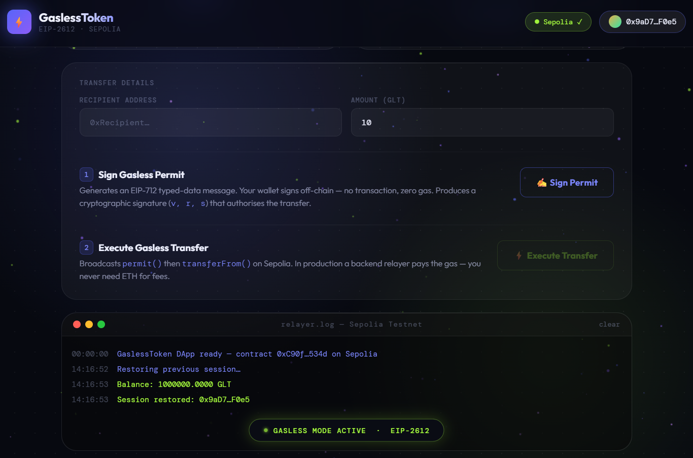

# ⚡ Gasless Token dApp (EIP-2612)


> A Web3 dApp that enables **gasless token transfers** using the 
> EIP-2612 permit mechanism. Users can approve and transfer tokens 
> **without paying gas fees**, thanks to off-chain signatures and a relayer.

---

## 🌐 Live Demo

| Link | URL |
|------|-----|
| 🖥️ Frontend | [gasless-token-dapp.vercel.app](https://gasless-token-dapp.vercel.app) |
| 📋 Contract | [View on Etherscan](https://sepolia.etherscan.io/address/0x54897bb92b72CeA9ff80b19E10b15EC8cE0C7c5C) |

---

## 📸 Screenshots

### 🏠 Main Interface


### 💸 Transfer Flow


## 🔥 Features

- ✅ Gasless approvals using **EIP-2612 (permit)**
- ✅ Off-chain signature (no gas required)
- ✅ Relayer executes transactions on behalf of user
- ✅ ERC20 token with permit functionality
- ✅ Sepolia testnet integration
- ✅ Clean frontend with MetaMask support

---

## 🛠️ Tech Stack

| Technology | Purpose |
|------------|---------|
| Solidity (ERC20 + EIP-2612) | Smart contract logic |
| Hardhat | Development & deployment |
| Ethers.js | Blockchain interaction |
| HTML/CSS/JavaScript | Frontend UI |
| MetaMask | Wallet connection |
| Sepolia Testnet | Live deployment |

---

## 🚀 Getting Started

### Prerequisites
- Node.js v16+
- MetaMask browser extension
- Git

### Installation

```bash
# Clone the repo
git clone https://github.com/Shrijeet8/gasless-token-dapp.git

cd gasless-token-dapp

npm install
```

### Environment Setup

```bash
cp .env.example .env
# Add your SEPOLIA_RPC_URL and PRIVATE_KEY
```

### Deploy Contract

```bash
npx hardhat compile
npx hardhat run scripts/deploy.js --network sepolia
```

---

## 📦 Smart Contract

| Detail | Info |
|--------|------|
| Network | Sepolia Testnet |
| Contract Address | `0x54897bb92b72CeA9ff80b19E10b15EC8cE0C7c5C` |
| Standard | ERC20 + EIP-2612 |
| Key Functions | `permit()`, `transferFrom()` |

[🔍 View on Etherscan](https://sepolia.etherscan.io/address/0x54897bb92b72CeA9ff80b19E10b15EC8cE0C7c5C)

---

## 🔮 Future Improvements

- [ ] Add gasless batch transfers
- [ ] Multi-token support
- [ ] Deploy on Polygon mainnet
- [ ] Add transaction history UI
- [ ] Write complete test suite

---

## ⚠️ Important

Never commit your `.env` file! Add it to `.gitignore`:
.env
---

## 📄 License

MIT License — feel free to fork and build!

---

<p align="center">
  Made with ❤️ by <a href="https://github.com/Shrijeet8">Shrijeet</a>
</p>
